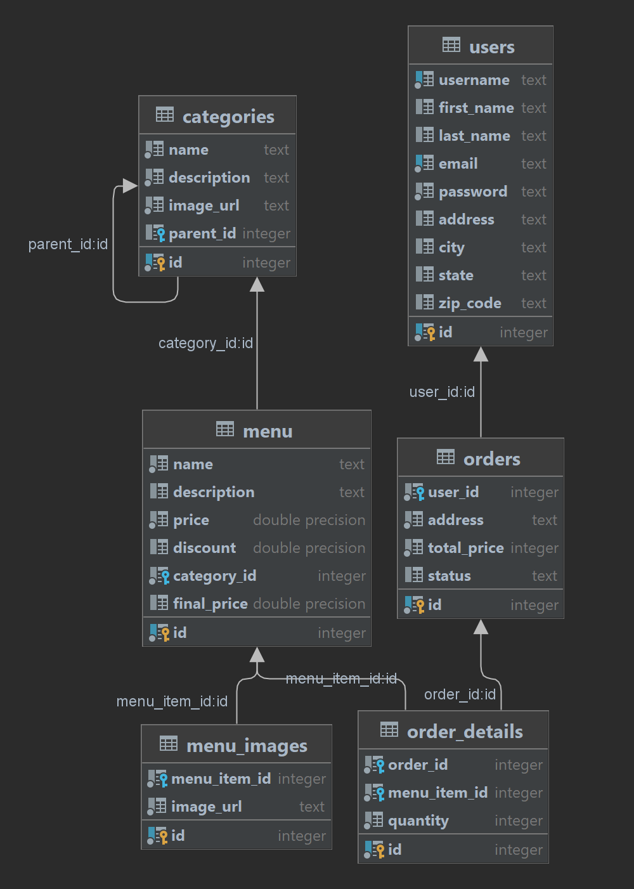

# Sofreh

## Overview

A brief description of backend and its purpose.

## OpenAPI Schema

[OpenAPI Documentation](https://petstore.swagger.io/?url=https://raw.githubusercontent.com/Seyydmasoud/Sofreh/Backend/openapi_schema.json)

This JSON file defines the structure of your API and provides information on endpoints, request/response formats, and
more.

## Database Structure

Include a visual representation of your database structure using a diagram.

## Usage

Include examples of how to use your backend, API endpoints, and any other relevant information.

## Contributing

If you want others to contribute to your project, provide guidelines for contributing.

## License

This project is licensed under the [Apache License 2.0](LICENSE).
 